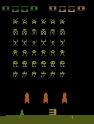

# RL Space Invaders (Atari)

## Goal
Train and evaluate reinforcement learning agents on Space Invaders (Atari) and compare performance.

## Environment
- Gymnasium Atari: SpaceInvaders (RAM) 
- Reward: game score
- Observation: RAM 

## Algorithms implemented
- A2C
- Dueling DDQN 
- PPO 

## Results
- Best average score: 300 ~ 360 for PPO agents.
- 

## Repo structure
- `notebook/` - experiments and analysis
- `src/` - reusable training/eval code (WIP)
- `assets/` - plots, diagrams, gifs

## How to run (quickstart)
This notebook file is for running environment: Google colab
Start running using google colab environment. This notebook file includes all the necsessary environment setup packages to install.  
